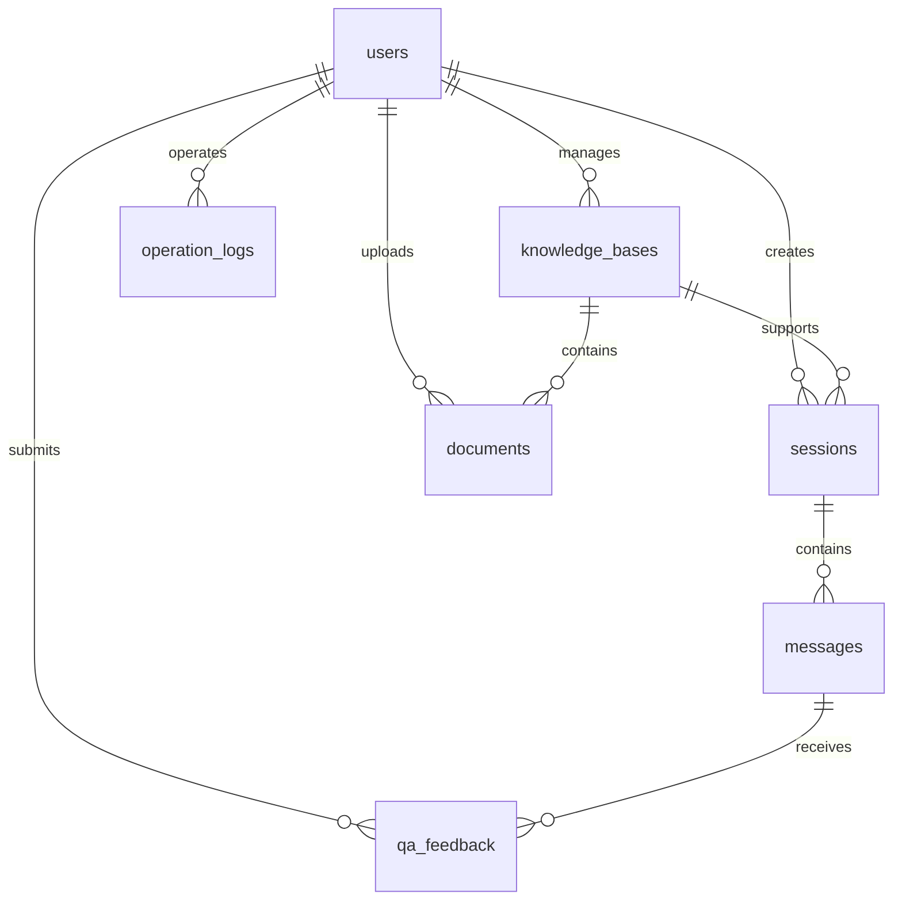

# AI 智能客服系统数据库设计说明书

> 版本：1.1（完善版）  
> 状态：可用于初始开发与联调  
> 数据库：MySQL 8.0 + Redis 6.x + ChromaDB  
> 对应代码：`database/schema.sql`、`database/seed.sql`

## 1. 引言

### 1.1 编写目的

本文档在已有《数据库设计说明书》初稿基础上补充字段约束、外键关系、索引规划、缓存设计、向量库设计和数据安全要求，为 AI 智能客服系统的编码、联调、测试和后续部署提供数据库设计依据。

### 1.2 设计范围

数据库设计覆盖以下数据域：

| 数据域 | 主要内容 | 存储介质 |
| --- | --- | --- |
| 用户身份域 | 用户账号、角色、状态、登录锁定信息 | MySQL + Redis |
| 知识库域 | 知识库、上传文档、文档入库状态 | MySQL |
| 对话域 | 会话、消息、AI回答来源引用 | MySQL |
| 质量反馈域 | 用户对 AI 回答的有用/无用反馈 | MySQL |
| 审计域 | 管理端关键操作记录 | MySQL |
| 向量检索域 | 文档切片向量、切片元数据 | ChromaDB |
| 缓存域 | Token 黑名单、限流计数、登录失败计数 | Redis |

### 1.3 命名约定

- 数据库名：`ai_customer_service`
- 表名：小写复数形式，例如 `users`、`messages`
- 字段名：小写下划线，例如 `created_at`
- 主键名：`表名单数_id`，例如 `user_id`
- 外键名：`fk_表名_关联对象`
- 唯一索引名：`uk_表名_字段`
- 普通索引名：`idx_表名_字段`

## 2. 外部设计

### 2.1 数据库标识

| 项目 | 说明 |
| --- | --- |
| 关系数据库 | MySQL Community Server 8.0+ |
| 数据库名称 | `ai_customer_service` |
| 字符集 | `utf8mb4` |
| 排序规则 | `utf8mb4_unicode_ci` |
| 存储引擎 | InnoDB |
| 缓存数据库 | Redis 6.x |
| 向量数据库 | ChromaDB，本地持久化目录 |

### 2.2 使用程序

| 服务 | 访问对象 | 操作类型 |
| --- | --- | --- |
| Gateway | Redis Token 黑名单、限流计数 | 读写 |
| user-service | `users` | 增删改查 |
| chat-service | `sessions`、`messages`、`qa_feedback` | 增删改查 |
| knowledge-service | `knowledge_bases`、`documents`、ChromaDB collection | 增删改查 |
| ai-service | ChromaDB collection、DashScope API | 检索、生成、向量化 |
| admin 后台 | `users`、`knowledge_bases`、`documents`、`operation_logs` | 查询、管理 |

### 2.3 设计约束

- 密码只保存 bcrypt 哈希，禁止保存明文密码。
- 用户、会话、消息、知识库元数据保存于 MySQL。
- 文档原文文件保存于文件系统或对象存储，MySQL 只保存路径、哈希和状态。
- 文档切片向量不写入 MySQL，统一存储在 ChromaDB。
- Token 黑名单、登录失败计数和限流计数优先使用 Redis，MySQL 只保存账号锁定的最终状态。
- 删除会话、禁用用户、删除文档均采用状态标记，避免直接物理删除影响审计和追溯。

## 3. 概念结构设计

### 3.1 实体关系图



### 3.2 关系说明

| 关系 | 类型 | 说明 |
| --- | --- | --- |
| users - sessions | 1:N | 一个用户可创建多个客服会话 |
| knowledge_bases - documents | 1:N | 一个知识库包含多个文档 |
| knowledge_bases - sessions | 1:N | 一个知识库可被多个会话使用 |
| sessions - messages | 1:N | 一个会话包含多条用户/AI消息 |
| messages - qa_feedback | 1:N | AI回答可被用户反馈 |
| users - operation_logs | 1:N | 管理员操作写入审计日志 |

## 4. 逻辑结构设计

### 4.1 用户信息表 users

用途：保存普通用户和管理员账号信息。

| 字段 | 类型 | 约束 | 说明 |
| --- | --- | --- | --- |
| user_id | BIGINT UNSIGNED | PK, AUTO_INCREMENT | 用户ID |
| username | VARCHAR(50) | NOT NULL, UNIQUE | 用户名 |
| phone | VARCHAR(20) | NOT NULL, UNIQUE | 手机号 |
| email | VARCHAR(100) | UNIQUE, NULL | 邮箱 |
| password_hash | VARCHAR(255) | NOT NULL | bcrypt 密码哈希 |
| role | VARCHAR(20) | NOT NULL, DEFAULT 'user' | `user`、`admin` |
| status | TINYINT | NOT NULL, DEFAULT 1 | 1正常、0禁用 |
| login_failed_count | INT | NOT NULL, DEFAULT 0 | 连续登录失败次数 |
| locked_until | DATETIME | NULL | 账号锁定截止时间 |
| created_at | DATETIME | NOT NULL | 注册时间 |
| updated_at | DATETIME | NOT NULL | 更新时间 |
| last_login_at | DATETIME | NULL | 最后登录时间 |

索引：

| 索引 | 类型 | 字段 | 用途 |
| --- | --- | --- | --- |
| PRIMARY | 主键 | user_id | 主键查询 |
| uk_users_username | 唯一 | username | 注册唯一校验、登录 |
| uk_users_phone | 唯一 | phone | 注册唯一校验、登录 |
| uk_users_email | 唯一 | email | 邮箱唯一 |
| idx_users_role_status | 普通 | role, status | 后台用户筛选 |
| idx_users_locked_until | 普通 | locked_until | 锁定账号扫描 |

### 4.2 知识库表 knowledge_bases

用途：保存企业知识库基本信息。

| 字段 | 类型 | 约束 | 说明 |
| --- | --- | --- | --- |
| kb_id | BIGINT UNSIGNED | PK, AUTO_INCREMENT | 知识库ID |
| name | VARCHAR(100) | NOT NULL, UNIQUE | 知识库名称 |
| description | VARCHAR(500) | NULL | 知识库描述 |
| status | VARCHAR(20) | NOT NULL | `enabled`、`disabled` |
| document_count | INT | NOT NULL, DEFAULT 0 | 已入库文档数 |
| created_by | BIGINT UNSIGNED | FK, NOT NULL | 创建人 |
| created_at | DATETIME | NOT NULL | 创建时间 |
| updated_at | DATETIME | NOT NULL | 更新时间 |

主要约束：`created_by` 关联 `users.user_id`。知识库禁用后不再参与新会话问答。

### 4.3 文档表 documents

用途：保存上传文档的元数据和入库状态。

| 字段 | 类型 | 约束 | 说明 |
| --- | --- | --- | --- |
| document_id | BIGINT UNSIGNED | PK, AUTO_INCREMENT | 文档ID |
| kb_id | BIGINT UNSIGNED | FK, NOT NULL | 所属知识库 |
| file_name | VARCHAR(255) | NOT NULL | 文件名 |
| file_type | VARCHAR(20) | NOT NULL | `txt`、`pdf`、`docx` |
| file_size | INT UNSIGNED | NOT NULL | 文件大小 |
| file_path | VARCHAR(500) | NOT NULL | 文件存储路径 |
| content_hash | CHAR(64) | NULL | SHA-256 哈希 |
| status | VARCHAR(20) | NOT NULL | `pending`、`ready`、`failed`、`deleted` |
| chunk_count | INT | NOT NULL | 文档切片数量 |
| error_message | VARCHAR(500) | NULL | 入库失败原因 |
| created_by | BIGINT UNSIGNED | FK, NOT NULL | 上传人 |
| created_at | DATETIME | NOT NULL | 上传时间 |
| updated_at | DATETIME | NOT NULL | 更新时间 |
| processed_at | DATETIME | NULL | 入库完成时间 |

索引与约束：

| 索引 | 字段 | 用途 |
| --- | --- | --- |
| idx_documents_kb_status | kb_id, status | 查询某知识库下指定状态文档 |
| idx_documents_created_by | created_by | 查询上传人文档 |
| uk_documents_kb_hash | kb_id, content_hash | 防止同一知识库重复上传相同内容 |

### 4.4 会话表 sessions

用途：保存用户与 AI 客服的一次对话会话。

| 字段 | 类型 | 约束 | 说明 |
| --- | --- | --- | --- |
| session_id | BIGINT UNSIGNED | PK, AUTO_INCREMENT | 会话ID |
| user_id | BIGINT UNSIGNED | FK, NOT NULL | 用户ID |
| kb_id | BIGINT UNSIGNED | FK, NULL | 使用的知识库 |
| title | VARCHAR(100) | NOT NULL | 会话标题 |
| status | TINYINT | NOT NULL | 1进行中、0已删除 |
| created_at | DATETIME | NOT NULL | 创建时间 |
| updated_at | DATETIME | NOT NULL | 更新时间 |
| last_message_at | DATETIME | NULL | 最后消息时间 |

索引：`idx_sessions_user_updated(user_id, updated_at)` 用于用户会话列表倒序展示。

### 4.5 消息表 messages

用途：保存用户消息、AI回答和知识来源引用。

| 字段 | 类型 | 约束 | 说明 |
| --- | --- | --- | --- |
| message_id | BIGINT UNSIGNED | PK, AUTO_INCREMENT | 消息ID |
| session_id | BIGINT UNSIGNED | FK, NOT NULL | 会话ID |
| role | VARCHAR(20) | NOT NULL | `user`、`assistant`、`system` |
| content | MEDIUMTEXT | NOT NULL | 消息内容 |
| sources | JSON | NULL | AI回答引用来源 |
| token_count | INT | NOT NULL | 估算 token 数 |
| latency_ms | INT | NOT NULL | 生成耗时 |
| model_name | VARCHAR(100) | NULL | 调用模型名称 |
| created_at | DATETIME | NOT NULL | 创建时间 |

`sources` JSON 示例：

```json
[
  {
    "document_id": 1,
    "doc_name": "扫地机器人故障排查手册.txt",
    "score": 0.93,
    "snippet": "扫地机器人无法开机时，请先检查电源适配器..."
  }
]
```

### 4.6 AI回答反馈表 qa_feedback

用途：保存用户对 AI 回答的质量反馈。

| 字段 | 类型 | 约束 | 说明 |
| --- | --- | --- | --- |
| feedback_id | BIGINT UNSIGNED | PK, AUTO_INCREMENT | 反馈ID |
| message_id | BIGINT UNSIGNED | FK, NOT NULL | AI回答消息ID |
| user_id | BIGINT UNSIGNED | FK, NOT NULL | 反馈用户ID |
| rating | TINYINT | NOT NULL | 1有帮助、-1无帮助 |
| comment | VARCHAR(500) | NULL | 反馈说明 |
| created_at | DATETIME | NOT NULL | 反馈时间 |

约束：`uk_feedback_message_user(message_id, user_id)` 防止同一用户重复反馈同一回答。

### 4.7 操作审计日志表 operation_logs

用途：记录管理员上传文档、删除文档、禁用用户等关键操作。

| 字段 | 类型 | 约束 | 说明 |
| --- | --- | --- | --- |
| log_id | BIGINT UNSIGNED | PK, AUTO_INCREMENT | 日志ID |
| operator_id | BIGINT UNSIGNED | FK, NOT NULL | 操作人 |
| action | VARCHAR(80) | NOT NULL | 操作动作 |
| target_type | VARCHAR(50) | NULL | 对象类型 |
| target_id | BIGINT UNSIGNED | NULL | 对象ID |
| detail | JSON | NULL | 操作详情 |
| ip_address | VARCHAR(45) | NULL | IP地址 |
| created_at | DATETIME | NOT NULL | 操作时间 |

## 5. ChromaDB 向量库设计

### 5.1 Collection 规划

| Collection | 说明 |
| --- | --- |
| `kb_{kb_id}` | 每个知识库一个 collection，便于按知识库隔离检索 |

### 5.2 向量记录结构

| 字段 | 说明 |
| --- | --- |
| id | `{document_id}-{chunk_index}` |
| embedding | 文本向量 |
| document | 文档切片文本 |
| metadata.document_id | 关联 MySQL `documents.document_id` |
| metadata.file_name | 来源文件名 |
| metadata.chunk_index | 切片序号 |
| metadata.source | 展示给用户的来源名称 |

### 5.3 文档入库流程

1. `knowledge-service` 保存上传文件，写入 `documents`，状态为 `pending`。
2. 解析 PDF/TXT/DOCX，清洗文本。
3. 按 500-800 字切片，重叠 100 字。
4. 调用 `ai-service /api/ai/embedding` 生成向量。
5. 写入 ChromaDB 的 `kb_{kb_id}` collection。
6. 更新 `documents.status = ready`、`chunk_count`、`processed_at`。
7. 失败时写入 `status = failed` 与 `error_message`。

## 6. Redis 缓存设计

| Key | 类型 | TTL | 说明 |
| --- | --- | --- | --- |
| `auth:blacklist:{jti}` | String | token 剩余有效期 | 退出登录后的 Token 黑名单 |
| `login:fail:{account}` | String/Counter | 30 min | 登录失败次数，超过5次锁定 |
| `rate:user:{user_id}` | Counter | 60 sec | 用户接口限流 |
| `rate:ip:{ip}` | Counter | 60 sec | IP 限流 |
| `session:ctx:{session_id}` | List/JSON | 2 h | 最近多轮对话上下文缓存 |
| `doc:task:{document_id}` | Hash | 24 h | 文档入库异步任务状态 |

## 7. 数据字典

### 7.1 用户角色

| 值 | 含义 |
| --- | --- |
| user | 普通咨询用户 |
| admin | 企业管理员 |

### 7.2 通用状态

| 对象 | 字段 | 值 | 含义 |
| --- | --- | --- | --- |
| users | status | 1 | 正常 |
| users | status | 0 | 禁用 |
| sessions | status | 1 | 进行中 |
| sessions | status | 0 | 已删除 |
| knowledge_bases | status | enabled | 启用 |
| knowledge_bases | status | disabled | 禁用 |
| documents | status | pending | 待入库 |
| documents | status | ready | 已入库 |
| documents | status | failed | 入库失败 |
| documents | status | deleted | 已删除 |

## 8. 典型查询

查询用户会话列表：

```sql
SELECT
  s.session_id,
  s.title,
  s.kb_id,
  s.updated_at,
  m.content AS last_message_preview
FROM sessions s
LEFT JOIN messages m
  ON m.message_id = (
    SELECT m2.message_id
    FROM messages m2
    WHERE m2.session_id = s.session_id
    ORDER BY m2.created_at DESC
    LIMIT 1
  )
WHERE s.user_id = ?
  AND s.status = 1
ORDER BY s.updated_at DESC
LIMIT ?, ?;
```

查询知识库文档状态统计：

```sql
SELECT
  kb.kb_id,
  kb.name,
  d.status,
  COUNT(d.document_id) AS document_count
FROM knowledge_bases kb
LEFT JOIN documents d ON d.kb_id = kb.kb_id
GROUP BY kb.kb_id, kb.name, d.status;
```

## 9. 安全与备份

- 所有 SQL 使用参数化查询，禁止字符串拼接 SQL。
- 生产环境按服务拆分数据库账号权限。
- `password_hash`、Token、DashScope API Key 不写入日志。
- MySQL 每日 `mysqldump`；ChromaDB 按目录备份；上传文档目录同步备份。
- 恢复时先恢复 MySQL，再恢复上传文件，最后重建或恢复 ChromaDB collection。
